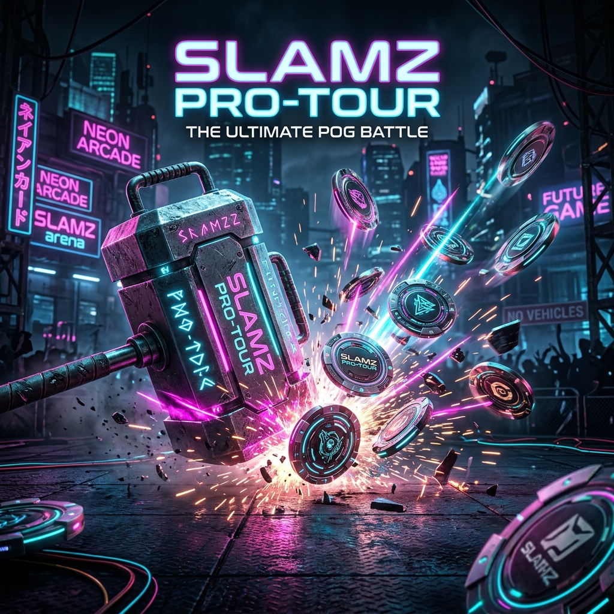

# 🛸 SLAMZ PRO-TOUR | VIBEJAM 2026



## 🏛️ Project DNA: "Cinematic Pure"
**SLAMZ PRO-TOUR** is a high-octane 3D arcade reimagining of the classic 90s POG phenomenon. Built for **VibeJam 2026**, it prioritizes visceral impact, bullet-time physics, and a seamless desktop-first experience.

The "Cinematic Pure" philosophy ensures that the player's focus is always on the impact. We've stripped away the clutter to deliver professional-grade physics orchestration and a high-fidelity cyberpunk aesthetic.

---

## 🚀 Key Features

### 🌪️ Cinematic Engine & Visual Polish
- **Bullet-Time Impact**: Real-time time-dilation on impact with a 360-degree orbital "Action Cam."
- **Cyber-Alley Environment**: Dynamic neon lighting, volumetric fog, and a gritty high-fidelity atmosphere.
- **Glassmorphic UI**: Premium, translucent HUD elements inspired by modern "AAAA" game design.
- **CRT Post-Processing**: Authentic retro-future scanline and chromatic aberration overlays.

### ⚙️ Heavy-Weight Physics Orchestration
- **Rapier x Three.js Synergy**: High-precision physics with custom "Volcanic" impulse release.
- **Calibrated Gravity**: Boosted constants (-16) for a satisfying "thump" feel.
- **Damping Management**: "Viscosity Brakes" that stabilize chaos into cinematic beauty.
- **Settle Detection**: Smart algorithms that know exactly when the dust has settled to trigger the jackpot.

### 🃏 Collection Management
- **The Showcase**: A dedicated prize-viewing suite with per-POG lighting and rarity fanfare.
- **Set Completion**: Track your progress through iconic 90s sets (TMNT, Mortal Kombat, and more).
- **Physical Interaction**: Inspect your prizes in 3D with direct mouse/touch manipulation.

---

## 🛠️ Tech Stack

- **Core**: React 18, TypeScript, Vite
- **3D Engine**: Three.js (@react-three/fiber, @react-three/drei)
- **Physics**: Rapier (@react-three/rapier)
- **Animation**: GSAP, Framer Motion
- **State**: Zustand
- **Styling**: Vanilla CSS (Custom tokens)

---

## ⚡ Quick Start

### Prerequisites
- Node.js (v18+)
- npm

### Installation
```bash
git clone https://github.com/zimzalabim69/slamz-pog-v2.git
cd slamz-pog-v2
npm install
```

### Dev Mode
```bash
npm run dev
```
*The app will launch on `http://localhost:4173` (calibrated for performance).*

---

## 📂 Documentation

- [**SLAMZ_HANDOFF.md**](./SLAMZ_HANDOFF.md): The project "Source of Truth" and architectural deep-dive.
- [**DEVELOPER_GUIDE.md**](./DEVELOPER_GUIDES.md): Physics registry, magic numbers, and contribution rules.
- [**PORT_DOCUMENTATION.md**](./PORT_DOCUMENTATION.md): Reference for dev server and port configuration.
- [**CHANGELOG.md**](./CHANGELOG.md): Tracking the evolution from MVP to V2.

---

## 🏆 VibeJam 2026 Submission
This project is submitted as a demonstration of **Advanced Agentic Coding** and high-fidelity web-based game design.

**Slam on.** 🛸💥

---

© 2026 SLAMZ PRO-TOUR TEAM. All Rights Reserved.
